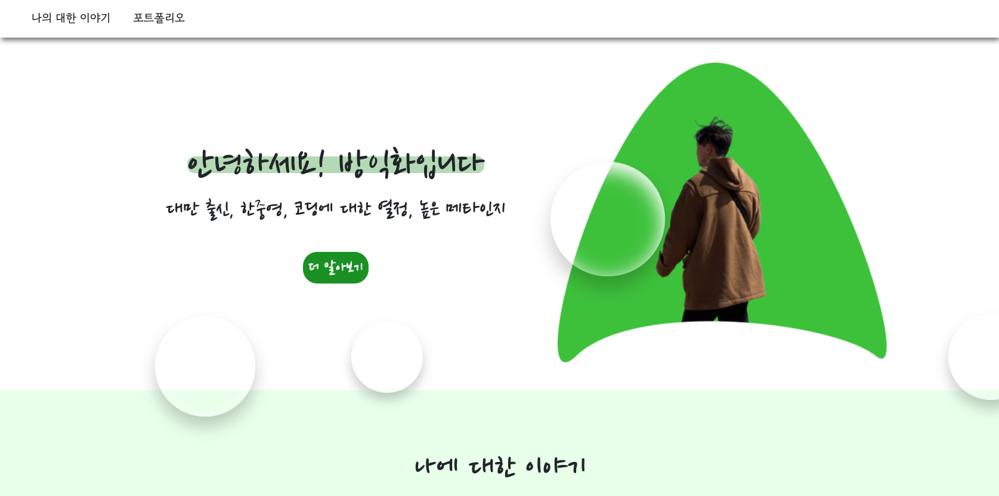
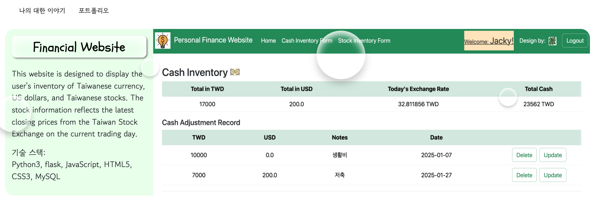

📑 個人作品集網站
===

[前往網站](https://jackyfang-portfolio.netlify.app/)
--

介紹
---
這是一個用來展示我的履歷與作品集的靜態網站，並特別強調UI設計。網站運用Flexbox實作響應式網頁設計(RWD)，結合Bootstrap進度條以增強視覺呈現，並在背景加入以CSS 製作的半透明氣泡動畫，營造動態且具層次感的視覺效果。

技術堆疊
---
* 前端:`JavaScript`, `HTML`, `CSS`
* 框架: `Bootstrap`

使用者介面
---
    
#### 首頁:

#### 作品集頁面:

