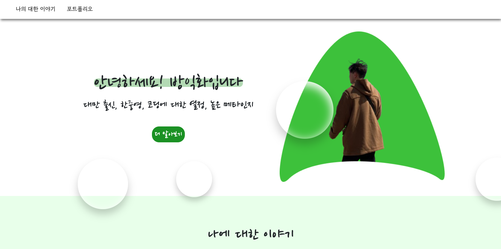
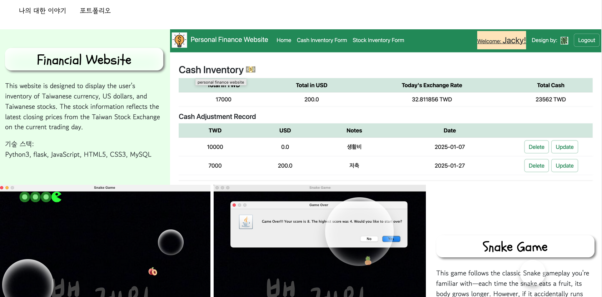

📑 개인 포트폴리오 웹사이트
===

[웹사이트 가기](https://jackyfang-portfolio.netlify.app/)
--

소개
---
이 사이트는 이력서와 포트폴리오를 보여 주기 위해 제작한 정적 웹사이트로, UI 디자인에 특히 중점을 두었습니다. Flexbox를 활용해 반응형 웹 디자인(RWD) 을 구현했고, 시각적 완성도를 높이기 위해 부트스트랩(Bootstrap) 진행률 표시줄을 사용했으며, 배경에는 CSS 기반의 반투명 애니메이션 버블을 더해 역동적이고 레이어드된 시각 효과를 제공합니다.

기술 스택
---
* 프론트엔드:`JavaScript`, `HTML`, `CSS`
* 프레임워크: `Bootstrap`

사용자 인터페이스
---
    
#### 홈 페이지:

#### 포트폴리오 페이지:

